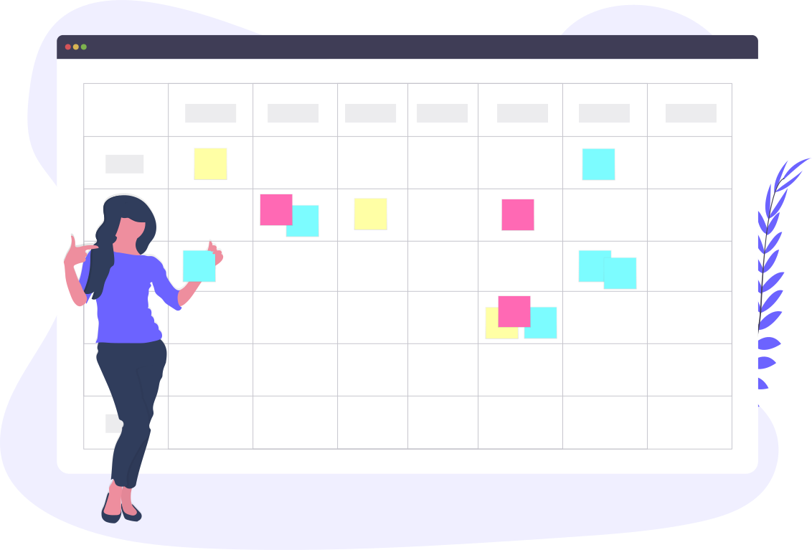
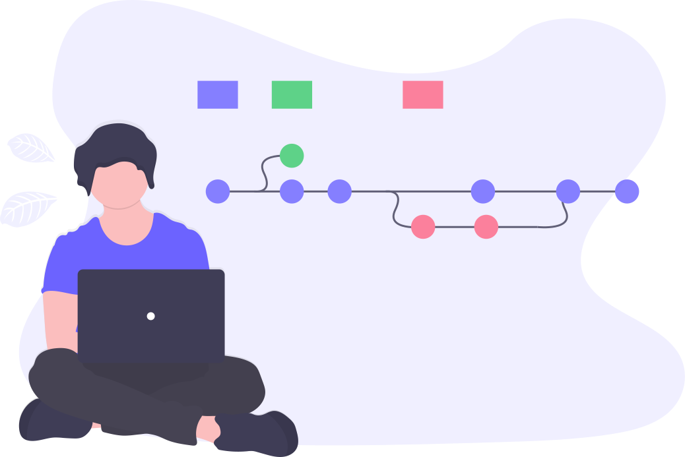
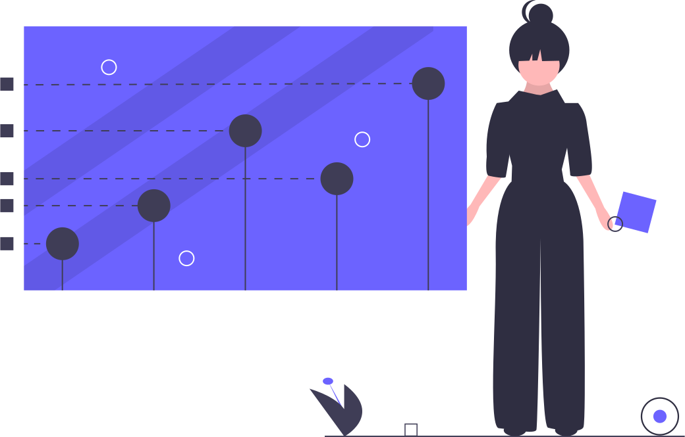

layout: true
class: center, middle, inverse
---

# Usando Gitlab para gestionar proyectos

---
layout: true
class: animated fadeInUp
---
## Agenda

(Tiempo estimado: 1h)

* ¿Qué es Gitlab?
  - Introducción
  - Sabores
  - Personalización
* Componentes para PM
  - Issues (tarjetas)
  - Labels (etiquetas)
  - Boards (tableros)
  - Milestones (hitos o versiones)

---

## ¿Qué es Gitlab?

.center[<iframe width="640" height="360" src="//www.youtube.com/embed/LqLHtTfKhUk?rel=0" frameborder="0" allowfullscreen></iframe>]

* Gitlab viene en diferentes [sabores](https://about.gitlab.com/pricing/#gitlab-com).
* Gitlab saca [nuevas versiones](https://about.gitlab.com/blog/categories/releases/) de manera continua.
  - ¿Como sé [qué versión](http://git.psa.com.ar/help) estamos usando?
* Gitlab es [personalizable](http://git.psa.com.ar/profile/preferences).

???
   Anotar en la pizarra las diferentes funcionalidades expresadas en el video.
???
   Si se pone atención al primer video, vemos que nombra muy poco acerca de PM. 
   Por esto ver la dirección que GITLAB le quiere dar a su proyecto es importante.
   Eso se ve en la siguiente diapositiva.

---

## La direccion de GITLAB

* El foco en [donde esperamos](https://about.gitlab.com/direction/#depth).

???
   Recomendar la lectura completa como ejemplo de organización de proyectos.
   Siempre es bueno tomar buenos ejemplos, aunque sea en pequeñas porciones.

---

## Gestion de Proyectos con Gitlab

__Recordemos__: GITLAB no propone ninguna receta! 

???
   Explicar que el flujo de trabajo y el significado que se le quiere dar a las 
   cosas es algo que la herramienta no pauta. Algo que solemos decir, el proceso
   debe definir la herramienta a usar y no al reves.
---
__Gestion de Proyectos con Gitlab__

## Issues 

* Sirven para anotar __cualquier cosa__ que deba llevarse a cabo. 
* Pueden ser referenciados desde diferentes lugares.
* Pueden ser asignados.
* Se les puede agregar una estimación de tiempo.
* Se les puede agregar una fecha de finalización.
* Se les puede agregar o quitar etiquetas.
* Se pueden mover a otro proyecto.

---
__Gestion de Proyectos con Gitlab__

## Labels

* Son etiquetas que se les agregan o quitan a los issues.
* Pueden marcar lo que sea necesario para el proyecto.
* Se pueden usar para definir el flujo de trabajo del proyecto.
* Se pueden compartir entre proyectos mediante herencia y promoción.

---
__Gestion de Proyectos con Gitlab__

## Boards

* Tienen al menos dos columnas (_Open_ y _Done_)
* Pueden agregarse mas usando labels.
* Pueden filtrarse tarjetas.
* Puede haber un board diferente por nivel.

---
__Gestion de Proyectos con Gitlab__

## Milestones 

* Sirven para hacer marcas de tiempo y expectativas.
* Podrían equipararse, aunque no obigatoriamente, a las versiones.

---
class: center, middle, inverse

## Gracias!

