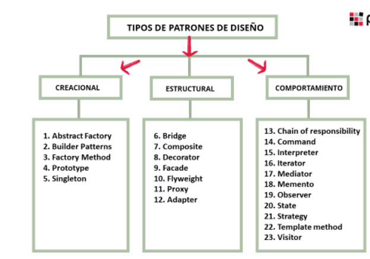
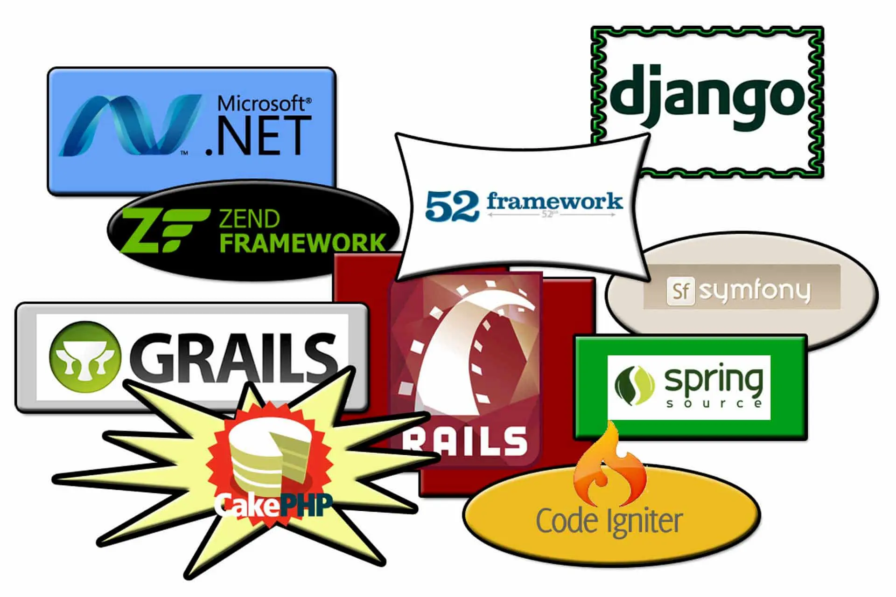
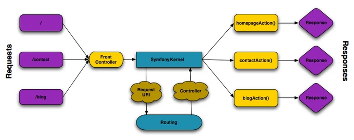
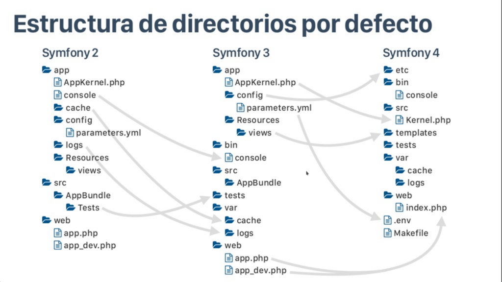
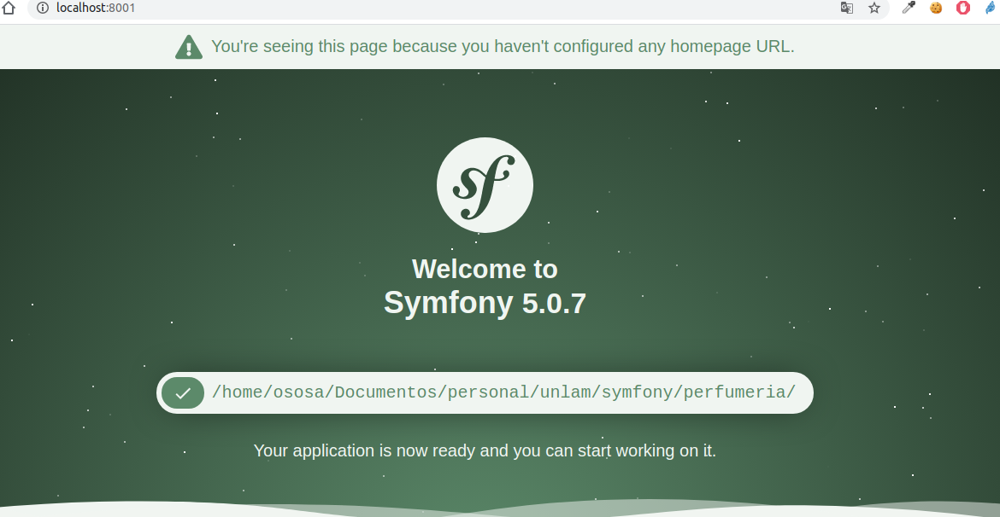
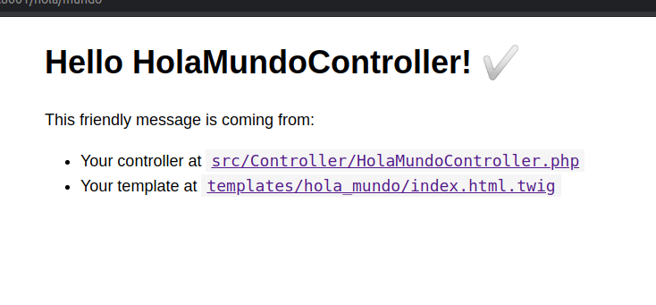
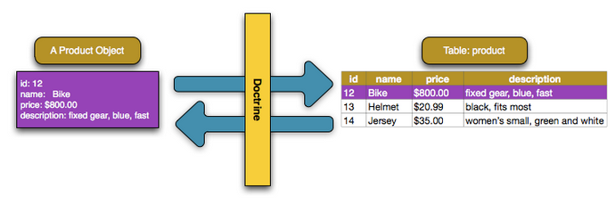

layout: true

class: center, middle, inverse
---

# Proyecto Symfony 5.0

---
layout: true
class: animated fadeInUp
---

## Agenda

(Tiempo estimado: 2h)

* Introduccion
  - Patrones de diseños
  - Patron MVC
  - ¿Que es un framework?
  - Consideraciones para tener en cuenta sobre la eleccion de un framework
* Symfony
  - ¿Porque usar Symfony?
  - Flujo Symfony
  - Estructura de directorio
  - Archivos importantes
  - Pre requisitos
  - intalacion motor Symfony
---

## Agenda

* Inicio de proyecto
   - Symfony `new project`
   - Caracteristicas del proyecto
   - Correr en proyecto Symfony `server:start` 
   - Visualizar proyecto
   - Creacion `controlador` y `template`
* Creando un proyecto a partir de un modelo de negocio
   - Presentacion de modelo de negocio
   - Algo de `mysql`
   - Archivos de configuracion `.env` y `.env.local`
   - Creacion de los controladores y template
   - Creacion de las estructura de tablas 
   - Migrar datos. 
   - Formularios Symfony
---

# Introduccion

## ¿ Que es un patron de diseño? 

.texto-grande[Los patrones de diseño son unas técnicas para resolver problemas comunes en el desarrollo de software y otros ámbitos referentes al diseño de interacción o interfaces]

---

## Atributos de un patron de diseño 

* .texto-grande[Su efectivad debe ser comprobada]
* .texto-grande[Debe ser reutilizable]
* .texto-grande[Nos debe hacer ahorran tiempo]
* .texto-grande[Nos ayudan a estar seguroe en el codigo generado]
* .texto-grande[Establece un forma de codificar en común]

---
# Introduccion

## ¿Cómo identificar qué patrón encaja con tu problema?

.texto-grande[La experiencia es la única forma válida de ser más hábil detectando dónde te pueden ayudar los patrones de diseño.]
.texto-grande[Necesitarás conocer qué tipo de problemas soluciona cada uno y descubrir cómo aplicarlo a casos concretos]

---

# Introducción

## Caracteristicas

* .texto-grande[Se debe haber verificado su efectividad resolviendo problema]

* .texto-grande[Debe ser reutilizable]

---

# Introduccion

## Categorías

.pull-right[
* `Patrones creacionales`: Son los que facilitan la tarea de creación de nuevos objetos.
* `Patrones estructurales`: Son patrones que nos facilitan la modelización de nuestros software  (Adapter, Composite, MVC, etc)
* `Patrones de comportamiento`: Se usan para gestionar algoritmos, relaciones y responsabilidades entre objetos (Iterator,Mediator, State, etc)
]

.pull-left[
   
]

---
# Introduccion

## Patron MVC

.texto-grande[MVC es un patrón de diseño que se estructura mediante tres componentes: `modelo`, `vista` y `controlador`. 

Este patrón tiene como principio que cada uno de los componentes esté separado en diferentes objetos.]

---

# Introduccion

## Patron MVC

.center[<iframe width="560" height="315" src="https://www.youtube.com/embed/zhSDjntidws" frameborder="0" allow="accelerometer; autoplay; encrypted-media; gyroscope; picture-in-picture" allowfullscreen></iframe>]

---

# Introduccion

## ¿Que es un Framework?

.pull-center[
   
]

.texto-mediano[Es una estructura conceptual y tecnológica de soporte definido. 
Normalmente con artefactos o módulos de software concretos, que puede servir de base para la organización y desarrollo de software]

---
# Introduccion

## ¿Cuales son las razones para utilizar un framework a la hora de programar? 

* Evitar escribir código repetitivo
* Utilizar buenas prácticas
* Permitir hacer cosas avanzadas que tú no harías
* Desarrollar más rápido

---
# Introduccion

## ¿Que factores a considerar a la hora de elegir un framework u otro? 

* Soporte de comunidad
* Documentación
* Simplicidad y potencia
* Arquitectura MVC
* Reutilización
* Patrón Active Record
* Posicionamiento
* Seguridad

---

# Symfony

* .texto-grande[Básicamente Symfony lo que hace es jugar con el servicio HTTP que todos conocemos.]

* .texto-grande[Symfony entra en la preparación de esa respuesta, y tiene la peculiaridad que aporta una estructura Modelo Vista Controlador que hace que el desarrollo sea bastante escalable.]

* .texto-grande[Toda su documentacion es publica y puede accederse desde  [Symfony](https://symfony.com/) ]  


---

# Symfony

## Flujo de symfony 

.pull-center[
   
]

---

# Symfony 

.pull-center[
   
]

---

# Symfony 

## Estructura de directorio

* `tests`: Donde se guardan los test de la aplicacion
* `templates`: Se guardan las plantillas .twig que correponde a las vistas del proyecto
* `config`: Se guardan todas las configuraciones del proyecto 
* `src`: Mantiene lo archivos fuentes del proyecto (entidades, controladores, etc)
* `var`: Archivos temporales como log, cache, cola de correo
* `public`: Todo los archivoc web
* `vendor`: Libreria actualizar el de kernel de Symfony

---

# Symfony 

# Archivos de importantes

* `.env`: Configuraciones del ambiente, protocolos de mail, base de datos, etc
* `config/parameters.yaml`: Contiene las configuracion del negocio del proyecto
* `config/routing.yaml`: Mapeo de direcciones
* `composer.json`: Archivo composer 
* `.gitignore`: Archivo git para ignorar actualizacion en el repositorio
* `composer.lock`:  

---

# Symfony

## Pre requisito

 * Un servidor web (Apache por ejemplo), 
 * un motor de bases de datos (MySQL, PostgreSQL, o SQLite), y PHP 5.2.4 o superior.
 * Para diferente instalaciones composer o git

---

# Symfony

## Instalar motor Symfony

La herramienta symfony nos simplifica el uso de la herramienta en el momento de actualizar la aplacion, tambien en la ejecucion de la herramienta, entre otras tareas.

* Descargar, instalar y comprobar funcionamiento tools`Symfony`

```markdow
$ curl -sS https://get.symfony.com/cli/installer | bash
$ mv /Users/weaverryan/.symfony/bin/symfony /usr/local/bin/symfony
$ symfony
```

Esta herramienta es solo sugerencia, por otro lado puede utilizar la herramienta que otorga smfony como libreria accediendo con el siguiente comando  `php bin/consola list`. Ver mas informacion en [Console Commands](https://symfony.com/doc/current/console.html)

---

# Inicio proyecto

## Comando Symfony  `new project`

> Documentacion oficial [Syfmony](https://symfony.com/doc/current/index.html)

Se podria crear desde un proyecto minimo con los componentes esenciales hasta un proyecto avanzado con funcionalidades pre-establecidas. 

* Desde el comando `Symfony`  un proyecto base 
```markdow
symfony new {nombre_proyecto}
```

* Desde el composer se puede generar un proyecto basico (sin motor de plantilla)
```markdow
composer create-project symfony/skeleton {nombre_proyecto}
```

* Tambien generar un website (con mas caracteristicas avanzadas) desde composer, el mas recomendado  
```markdow
composer create-project symfony/website-skeleton {nombre_proyecto}
```

---
# Inicio de proyecto

## Caracteristicas del proyecto instalado

Cabe destacar que por defecto se la descarga es sobre la ultima version de Symfony y pueden comprobarlo en el archivo `composer.json`: 

```markdow
"require": {
        "php": "^7.2.5",
        "ext-ctype": "*",
        "ext-iconv": "*",
        "symfony/console": "5.0.*",
        "symfony/dotenv": "5.0.*",
        "symfony/flex": "^1.3.1",
        "symfony/framework-bundle": "5.0.*",
        "symfony/yaml": "5.0.*"
    },
```
---

# Inicio de proyecto

## Correr aplicacion 

Luego de haber comprobado la insatalacion, debemos ubicarnos en el proyecto y correr el servidor

```markdow
$ symfony server:start

 [WARNING] run "symfony server:ca:install" first if you want to run the web server with TLS support, or use
 "--no-tls" to avoid this warning

Apr 25 17:31:48 |DEBUG| PHP    Reloading PHP versions 
Apr 25 17:31:48 |DEBUG| PHP    Using PHP version 7.2.24 (from default version in $PATH) 
Apr 25 17:31:48 |INFO | PHP    listening path="/usr/bin/php7.2" php="7.2.24" port=35249
Apr 25 17:31:48 |DEBUG| PHP    started 
                                                                                                                     
 [OK] Web server listening
      The Web server is using PHP CLI 7.2.24
                                                                                                                        
      http://127.0.0.1:8001
                                                                   
```
---
# Inicio de proyecto

## Visulizar aplicacion

Y vamos al navegar para ubicar nuestro sitio y su presentacion:

.pull-center[
   
]


---

# Inicio de proyecto

## Pagina inicial y router

Antes de comenzar debemos verificar la existencia de las siguientes carpetas. 

* **bin**: Contiene todos los script  de symfony como el uso de comandos de linea
* **config**: En esta carpeta se encuentran todos los archivos de configuracion, los por defecto el route.yaml y archivos de configuracion de todos los paquetes instalados (mailer, twig, translations, etc)
* **migrations**: En esta carpetas se encuentra doso los archivos que se generan cuando se modela la base de datos para luego migrar al motor correspondientes
* **public**: La carpeta raiz donde se encuentra en index.php y funcionara como enlace al publico
* **src**: Carpeta de codigo fuente donde se ubicaran los controladores del modelo MVC
* **templates**: Carpeta donde se ubicarion los `.twig ` correspondiente a los plantillas de la vista
* **vendor**: Nucleo de symfony, aqui se instalaran los paquetes  necesario para el uso basico del sitio

---

# Inicio de proyecto

## Pagina inicial y router

El paso siguiente es comprobar las rutas del proyecto con el siguiente comando: 

```markdow
$ symfony console debug:router
---------------- -------- -------- ------ -------------------------- 
  Name             Method   Scheme   Host   Path                      
---------------- -------- -------- ------ -------------------------- 
  _preview_error   ANY      ANY      ANY    /_error/{code}.{_format}  
---------------- -------- -------- ------ -------------------------- 

```

---

# Inicio de proyecto

## Pagina inicial y router

Ahora avanzamos creando un controlador y template con el siguiente comando:

```markdow
$ symfony console make:controller HolaMundo

created: src/Controller/HolaMundoController.php
created: templates/hola_mundo/index.html.twig

```

---

# Inicio de proyecto

## Pagina inicial y route

En este punto volvemos a correr el comando `symfony server:start` y nos dirigimos al navegador local visulizando las siguiente imagen: 

.pull-center[
   
]

---
# Creando un proyecto a partir de un modelo de negocio

## Presentacion del modelo de negocio 

Se presenta el siguiente modelo de negocio para modelar desde la herramienta. 

.pull-center[
   
]

---
# Creando un proyecto a partir de un modelo de negocio

## Algo de mysql 

Se debe comprobar la comprobacion a una conexion de base de datos 

```markdow 
$ mysql -uroot -p 

mysql> show databases;

+--------------------+
| Database           |
+--------------------+
| information_schema |
| mysql              |
| performance_schema |
| sys                |
+--------------------+
4 rows in set (0.02 sec)

```

---

# Creando un proyecto a partir de un modelo de negocio

## Configuro base de datos en symfony

Se debe modificar le archivo `.env.local` los siguientes campos: 

```markdow 
###> doctrine/doctrine-bundle ###
# Formato descripto en https://www.doctrine-project.org/projects/doctrine-dbal/en/latest/reference/configuration.html#connecting-using-a-url
# Configura tu db driver y server_version en config/packages/doctrine.yaml
# Remplaza las variables ${} segun tu configuracion
DATABASE_URL=mysql://${db_user}:${db_pass}@${db_host}:${db_port}/${db_name}
###< doctrine/doctrine-bundle ###
```

---
# Creando un proyecto a partir de un modelo de negocio

## Creo la base de datos en base a la configuración

La librerias que se necesitan es ORM por lo tanto es necesario instalarlas

```markdow 
composer require symfony/orm-pack
```

Luego se debe ejecutar el siguiente comando 

```markdow 
$symfony console doctrine:database:create
Created database `perfumeria` for connection named default
```

Finalizando, compruebo la base de datos creada

```markdow 
mysql> show databases;
+--------------------+
| Database           |
+--------------------+
| perfumeria         |
+--------------------+
```

---
# Creando un proyecto a partir de un modelo de negocio

## Creacion de las entidad `Product` segun el esquema

```markdow 
$ symfony console make:entity

Class name of the entity to create or update:
> Product

   created: src/Entity/Product.php
   created: src/Repository/ProductRepository.php

New property name (press <return> to stop adding fields):
> name
	
Field type (enter ? to see all types) [string]:
> string

Field length [255]:
> 255

Can this field be null in the database (nullable) (yes/no) [no]:
> no

(press enter again to finish)
```

---
# Creando un proyecto a partir de un modelo de negocio

## Creando los archivos de migraciones y ejucutar las migraciones

```markdow 
$ symfony console make:migration
```

Next: Review the new migration "src/Migrations/Version20180207231217.php" Then: Run the migration with php bin/console doctrine:migrations:migrate

```markdow 
$ symfony console doctrine:migrations:migrate
```

If you prefer to add new properties manually, the make:entity command can generate the getter & setter methods for you:

 php bin/console make:entity --regenerate
If you make some changes and want to regenerate all getter/setter methods, also pass --overwrite.

---
# Creando un proyecto a partir de un modelo de negocio

## Creando los controladores

```markdow
symfony console make:controller Product

created: src/Controller/ProductController.php
created: templates/product/index.html.twig

```
---

## ABM

Ya teniendo el controlador y la entidad debemos empezar a codificar los metodos correspondientes. Teniendo en cuenta que ya tenemos el correspondiente controlador estaremos generando los correspondientes metodos.

### Repository Product

```markdow
public function findOneBySomeField($value): ?Product
{
    return $this->createQueryBuilder('p')
        ->andWhere('p.id = :val')
        ->setParameter('val', $value)
        ->getQuery()
        ->getOneOrNullResult()
    ;
}
```

---

## ABM

### Metodo Listar

```markdow
public function listarProducto(){
    
    $repository = $this->getDoctrine()->getRepository(Product::class);
    $productos = $repository->findAll();
    dump($productos); 
    return $this->render('product/listar.html.twig', [
        'controller_name' => 'ProductController',
        'productos'=>$productos
    ]);
}
```

---
## ABM

### Metodo Crear 

```markdow
use App\Entity\Product;
class ProductController extends AbstractController{
public function crearProducto() : Response {  
        createProduct(EntityManagerInterface $entityManager)
        $entityManager = $this->getDoctrine()->getManager();
        $producto = new Producto();
        $producto->setName('Manzana');
        $producto->setPrice(300.5);
        $producto->setDescription('Manzanas riojanas');
        $entityManager->persist($producto);
        // (INSERT query)
        $entityManager->flush();
        return new Response('El identificador del producto es: '.$producto->getId());
    }
}
```

---

## ABM

### Mostrar producto

```markdow
 public function showProducto($id){
   $repository = $this->getDoctrine()->getRepository(Product::class);
        $producto = $repository->findOneBySomeField($id);
        return $this->render('product/show_producto.html.twig', [
            'id' => $id,
            'name'=> $producto->getName(),
            'price'=> $producto->getPrice(),
            'description' => $producto->getDescription()
        ]);
    }
```

---

## ABM

### Template listar

```markdow


Hello ProductController!


<style>
    .example-wrapper { margin: 1em auto; max-width: 800px; width: 95%; font: 18px/1.5 sans-serif; }
    .example-wrapper code { background: #F5F5F5; padding: 2px 6px; }
</style>

<div class="example-wrapper">
    <h1>Hello {{ controller_name }}! ✅</h1>

    This friendly message is coming from:
    <ul>
      
        <li>{{ producto.name }}</li>
        <li>{{ producto.price }}</li>
        <li>{{ producto.description}}</li>
    
    </ul>
</div>


```

---

### Incluir Boostraps en Symfony

Se puede implementar boostrap en los templates de Symfony incorporando el siguiente header 

```markdow
<!DOCTYPE html>
<html lang="en">
<head>
    <meta charset="UTF-8">
    <meta http-equiv="X-UA-Compatible" content="IE=edge">
    <meta name="viewport" content="width=device-width, initial-scale=1.0">
    <title></title>
    <link href="https://cdn.jsdelivr.net/npm/bootstrap@5.0.0-beta3/dist/css/bootstrap.min.css" rel="stylesheet" integrity="sha384-eOJMYsd53ii+scO/bJGFsiCZc+5NDVN2yr8+0RDqr0Ql0h+rP48ckxlpbzKgwra6" crossorigin="anonymous">   
</head>

<body>
    
</body>
</html>

```

---
### Incluir Boostraps en Symfony

```markdow


 Titulo en el header 

 
<div class="container">
    <div class="row p-2 text-secondary bg-dark">
        <form action="http://localhost/alta.php" class="form-horizontal" method="post">
            <fieldset>
                <legend class="text-left header">Contacto</legend>
                <div class="form-group mb-3">
                <div class="col-8">
                    <input id="fname" name="name" type="text" placeholder="Nombre" class="form-control">
                </div>
                </div>
             </fieldset>
            </form>
        </div>
   </div>
</div>
```
---

# Referencias

* [Ejemplos de patrones de diseños](https://github.com/jesusmatiz/design-patterns)
* [Tutorial sobre patrones de diseño](https://www.youtube.com/watch?v=7WNeeL6ijLM)
* [Instalar symfony y crear proyecto](https://symfonycasts.com/screencast/symfony/setup)
* [Ejemplo sencillo](https://uniwebsidad.com/libros/symfony-2-4/capitulo-8/un-ejemplo-sencillo)
* [ORM Doctrine](https://symfony.com/doc/current/doctrine.html)
* [Boostrap Symfony](https://www.acceseo.com/proyecto-symfony-4-webpack-encore-bootstrap-saas.html)
* [Webpack](https://symfony.com/doc/current/frontend/encore/installation.html)
* [Patron de diseños para Symfony](https://www.thinktocode.com/2018/03/05/repository-pattern-symfony/)

---
class: center, middle, inverse

## Gracias!

