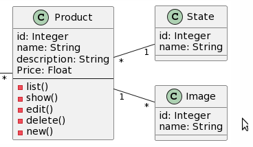
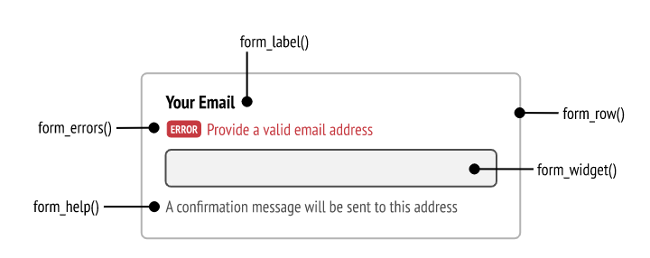
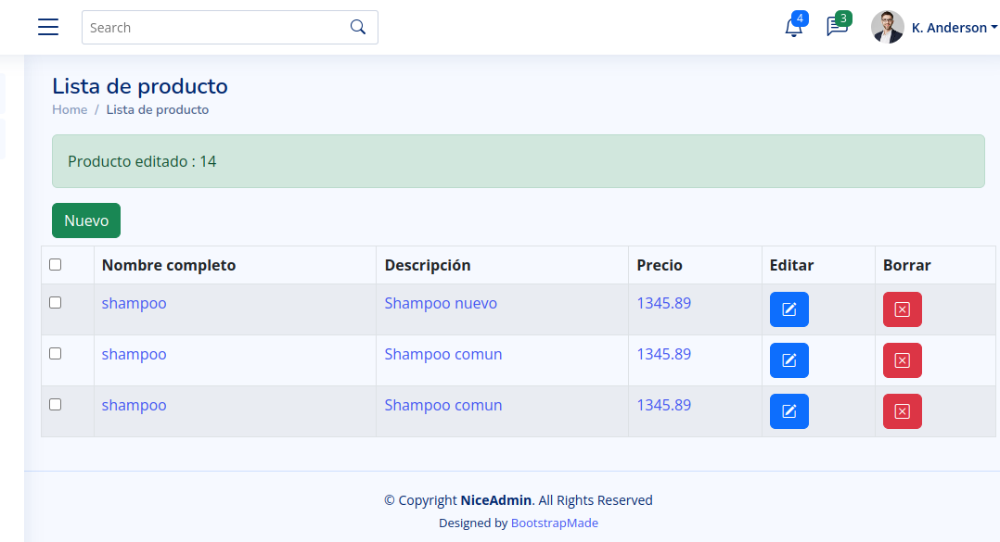

layout: true

class: center, middle, inverse
---

# Proyecto Symfony 5.0 (Parte 2)

---
layout: true
class: animated fadeInUp
---

## Agenda

(Tiempo estimado: 4h)

* Conceptos
    - MVC: Service
    - Formulario en Symfony
    - Excepciones
* Autenticacion
    - Concepto seguridad
    - Modulo Security
    - Customizacion login    

---

# Asignar y subir una imagen a un producto

## Modelo

En este ejemplo vamos agregar `Imagenes` a los productos. 

.pull-center[
    
]

---

# Asignar y subir una imagen a un producto

## Agrego una entidad extra `Image` y modifico la entidad actual `Product`

```markdown
$ symfony console make:entity Image
```

A la entidad Image la creo con un campo `name`y agrego una relación ManyToOne a `Product`.

Genero las migrations y tablas en db

```markdown
$ symfony console make:migration
$ symfony console doctrine:migrations:migrate
```

---

# Asignar y subir una imagen a un producto

## Agregar al template el campo 'FILE'

```html
<form action="#" method="post" enctype="multipart/form-data">
//.....
    <input type="file" id="pimage" name="pimage"/>
//....
</form>
``` 

---

# Asignar y subir una imagen a un producto

## Proceso el submit 

```php
//..
use App\Entity\Product;
use App\Entity\Image;
use Symfony\Component\HttpFoundation\File\UploadedFile;

//...

  if(isset($_POST['submit'])){
    //...
    $repository_image=$this->getDoctrine()->getRepository(Image::class);
    $image = new Image();
    $name = $_FILES['file']['name'];
    $type = $_FILES['file']['type'];
    $size = $_FILES['file']['size'];
    $temp_name= $_FILES['file']['tmp_name']
    //Guardar archivo
    move_uploaded_file($temp_name,  $name);
    $image->setName($name);
    $repository_image->add($image);
    $product->setImage($image);	
    //...
}

//...
```
---

# Manejo de servicios

## Conceptos de servicio

Los servicios funcionan de forma independiente al resto de la aplicación, a fin de cuentas, son clases independientes.

Los servicios en Symfony suelen interpretarse como ayuda o funcionalidades que se requieren en algunas accion de los controladores y son partes generica de uso, un ejemplo simple sería la subida de archivos en los servidores web. 

Los servicios se construyen en `src/Service/` y se definen en `config/services.yml`

En el ejemplo de [Uploader Service](https://symfony.com/doc/5.x/controller/upload_file.html#creating-an-uploader-service) puede describirse el desarrollo, configuracion y uso del servicio por parte del controladores Producto.

---

# Formularios

## Proceso

Para crear un buen sistema de formulario debemos tener en cuenta los diferentes pasos :

1. **Crear la entidad** que se vinculara con la base de datos de nuestro sistema
1. **Crea el formulario** en un controlador Symfony o usando una clase de formulario dedicada
1. **Renderizar el formulario** en una plantilla para que el usuario pueda editarlo y enviarlo-
1. **Procese el formulario** para validar los datos enviados, transfórmelos en datos PHP y haga algo con ellos (por ejemplo, conservarlos en una base de datos).

[Crear formulario](https://symfony.com/doc/5.0/forms.html)

---

# Formularios

## Entidad
Sabiendo el nombre de la entidad crearemos el formulario `ProductType`

```markdown
$ symfony console make:form Product

 The name of Entity or fully qualified model class name that the new form will be bound to (empty for none):
 > Product

 created: src/Form/ProductType.php

```

---

# Formularios

## ProductType

Agregar los componentes necesarios

```php
// ...
use Symfony\Component\OptionsResolver\OptionsResolver;
use Symfony\Component\Form\Extension\Core\Type\TextType;
use Symfony\Component\Form\Extension\Core\Type\TextareaType;
use Symfony\Component\Form\Extension\Core\Type\FileType;
use Symfony\Component\Form\Extension\Core\Type\SubmitType;
use Symfony\Component\Form\Extension\Core\Type\ButtonType;
// ...
```

---

# Formularios

## ProductType

```markdown
namespace App\Form;
use App\Entity\Product;
use Symfony\Component\Form\AbstractType;
use Symfony\Component\Form\FormBuilderInterface;
use Symfony\Component\OptionsResolver\OptionsResolver;
class ArticuloType extends AbstractType
{
    public function buildForm(FormBuilderInterface $builder, array $options): void
    {
        $builder
            ->add('name'),
            ->add('price'),
            ->add('description')
    }
    public function configureOptions(OptionsResolver $resolver): void
    {
        $resolver->setDefaults([
            'data_class' => Product::class,
        ]);
    }
}
```
---

# Formularios

## ProductType

```php
$builder
    $builder
            ->add('name', TextType::class, [
                'attr' => ['class' => 'form-control','id'=>'pname' , 'name'=>'pname']
                , 'data'=>'Perfume'
            ])
            ->add('description' , TextareaType::class, [
                    'attr' => ['class' => 'form-control','id'=>"pdescription",'name'=>"pdescription"] 
                    , 'data'=>'Perfume'
            ])
            ->add('price', TextType::class, [
                'attr' => ['class' => 'form-control','id'=>"pprice", 'name'=>"price"] 
                 ,'data'=>'20'
            ])
    // ...

```

---

# Formularios

## ProductType

```php
// ... 
->add('image', FileType::class, [

                'attr' => ['class' => 'form-control'],
                'label' => false,
                'mapped' => false,
                'required' => false,
                'multiple' => true,
    
            ])
            ->add('state',  EntityType::class, [
                'class' => State::class,
                'choice_label' => 'name',
                'attr' => ['class' => 'form-control','id'=>"pstate", 'name'=>"state"],    
            ])
            ->add('save', SubmitType::class, [
                    'attr' => ['class' => 'btn btn-primary', 'name'=> 'submit'], 
                    'label'=> 'Aceptar'
                    
            ]);
//..
```

----

# Formulario

## Controller: Product new() 

En primera instancia se renderiza el formulario.


```php
use App\Form\ProductType;
class ProductController extends AbstractController
{
    public function new()
    {
        // ...

        $producto = new Product();
        $form = $this->createForm(ProductType::class, $producto);
        $form->handleRequest($request);
        
        if ($form->isSubmitted() && $form->isValid()) {
            $repository = $this->getDoctrine()->getRepository(Product::class);
            $repository->add($form->getData());
            $this->addFlash("success", 'El producto se guardo con exito.' );
            return $this->redirectToRoute("app_product_list");
        }
        
        return $this->render('product/new.html.twig', [
            'controller_name' => 'Nuevo producto',
            'form'=>$form->createView()
        ]);

        // ...
    }
}

```
---

# Formulario

## Controller: Product new() 

En segunda instancia se completa con la accion que se realiza el submit

```php
use App\Form\ProductType;
use Symfony\Component\HttpFoundation\Request;
/**
 * @Route("/product/new", name="app_product_new")
 */
public function new(Request $request): Response {

    $form = $this->createForm(ProductType::class, $producto);
    $form->handleRequest($request);

    if ($form->isSubmitted() && $form->isValid()) {
        $repository = $this->getDoctrine()->getRepository(Product::class);
        $repository->add($form->getData());
        $this->addFlash("success", 'El producto se guardo con exito.' );
        return $this->redirectToRoute("app_product_list");
    }

    // ...
}

```

----

# Formulario

## Controller: Product edit() 

```php
/**
* @Route("/backoffice/product/edit/{id}", name="app_backoffice_product_edit")
*/
public function edit($id, Request $request): Response
{
    $repository = $this->getDoctrine()->getRepository(Product::class);
    $producto=$repository->findById($id);

    if(!$producto){
        $this->addFlash("error", 'El producto no existe.' );
        return $this->redirectToRoute("app_product_list");
    }

    $form = $this->createForm(ProductType::class, $producto,  [
        'action' => $this->router->generate('app_product_edit', array('id'=>$id)),
        'method' => 'POST',
    ]);
    // ...
}
```

----

# Formulario

## Controller: Product edit() 

```php
/**
* @Route("/product/edit/{id}", name="app_product_edit")
*/
public function edit($id, Request $request): Response
{
    // ...
    $form->handleRequest($request);

    if ($form->isSubmitted() && $form->isValid()) {
        $repository->update($form->getData());
        $this->addFlash("success", 'El producto se edito con exito.' );
        return $this->redirectToRoute("app_product_list");
    } 

    return $this->render('product/edit.html.twig', [
        'controller_title' => 'Editar producto',
        'controller_name' => 'Editar producto',
        'form'=>$form->createView()
    ]);
}
```


---

# Formularios

## Personalizamos el formulario 

En el template podemos acceder la variable `form` creada en el controlador con las funciones `form_label()`, `form_widget()`, `form_help()` y `form_errors()` 

[Customizar el template](https://symfony.com/doc/5.0/form/form_customization.html)

.pull-center[
   
]

---

# Formularios

## Personalizamos el formulario.

```html



{{ form_start(form) }}
    <div class="form_errors">{{ form_errors(form) }}</div>
    <div class="row"><div class="col">{{ form_row(form.name) }}</div></div>
    <small>{{ form_help(form.name) }}</small>
    <div class="row"><div class="col">{{ form_row(form.description) }}</div></div>
    <div class="row"><div class="col">{{ form_row(form.price) }}</div></div>
    <div class="row"><div class="col">{{ form_row(form.state) }}</div></div>
    <hr>
    <div class="form-group">{{ form_widget(form.save) }}</div>
    <div class="form-group"><a href="{{ path('app_product_list') }}">{{ form_widget(form.cancel) }}</a></div>
{{ form_end(form) }}

```
---

# Formularios

## Adapto el formulario con Boostrap

```php
 $builder
     ->add('name', TextType::class, [
         'attr' => ['class' => 'form-control','id'=>'pname' , 'name'=>'pname']
     ])
     ->add('description' , TextareaType::class, [
         'attr' => ['class' => 'form-control','id'=>"pdescription",'name'=>"pdescription"] 
     ])
     // ...
     ->add('save', SubmitType::class, [
         'attr' => ['class' => 'btn btn-primary', 'name'=> 'submit'], 
         'label'=> 'Aceptar'      
     ])
     // ...

```
---

# Formularios
## Personalizamos el template con el formulario 

```html
{{ form_start(form) }}
<div class="row mb-3">
    <div class="col-sm-10">
        <div class="form-floating mb-3 mt-3">
            {{ form_widget(form.name) }}
            <label for="floatingName">{{ "backoffice.product.name"|trans }}</label>
        </div>
 
        // ...
        <div class="row mb-3">
            <div class="col-sm-3">
                {{ form_widget(form.save) }}
            </div>
           <div class="col-sm-5">
                <a href="{{ path('app_product_list') }}" class="btn btn-success">Cancel</a>
           </div>
        </div>
    </div> 
</div>
{{ form_end(form) }}
```

---

# Trabajo final

## Vista backoffice 

.pull-center[
   
]

---

# Controlar Excepciones

## Generamos el  ErrorSubscriber

Podemos controlar los errores caputarando los eventos generado por Symfony 5 mediante una suscripcion a los eventos.

`php bin/console make:subscriber ErrorSubscriber`

Vamos generando el codigo, comenzamos con los compontes 

```php
<?php

namespace App\EventSubscriber;

use Symfony\Component\EventDispatcher\EventSubscriberInterface;
use Symfony\Component\HttpKernel\Event\ExceptionEvent;
use Symfony\Component\HttpKernel\Exception\HttpExceptionInterface;
use Symfony\Component\HttpKernel\KernelEvents;
use Symfony\Component\HttpFoundation\Response;
use Symfony\Component\Routing\Generator\UrlGeneratorInterface;
use Twig\Environment;
```

# Controlar Excepciones

## Generamos el  ErrorSubscriber

Iniciamos los atributos
```php
// ...
class ErrorSubscriber implements EventSubscriberInterface
{
    private $twig;
    private $urlGenerator;
    
    // ...
}    
```
---

# Controlar Excepciones

## Generamos el  ErrorSubscriber

Iniciamos el contructor

```php
 // ...
 public function __construct(Environment $twig, UrlGeneratorInterface $urlGenerator)
 {
    $this->twig = $twig;
    $this->urlGenerator = $urlGenerator;
 }
 // ...
```
---

# Controlar Excepciones

## Generamos el  ErrorSubscriber

Contruimos el evento `getSubscribedEvents`
```php
// ...
public static function getSubscribedEvents(): array
{
    return [
        KernelEvents::EXCEPTION => 'onKernelException',
    ];
}
// ...        
```
Esta clase es un `EventSubscriber` que escucha el evento  `KernelEvents::EXCEPTION` cuando se produce una excepción, la clase determina el código de estado HTTP adecuado y el mensaje de error correspondiente, y luego devuelve una respuesta que muestra la plantilla `templates/error/error.html.twig` con los datos del código de estado y el mensaje de error.

---
# Controlar Excepciones

## Generamos el  ErrorSubscriber

Inicio el metodo `onKernelException`
```php
// ...
public function onKernelException(ExceptionEvent $event): void {
    $exception = $event->getThrowable();
    $statusCode = $exception instanceof HttpExceptionInterface ? $exception->getStatusCode() : 500;
    $referer = $event->getRequest()->headers->get('referer');
}
// ...
```

---

# Controlar Excepciones

## Generamos el  ErrorSubscriber

Proceso las opciones de los codigos de errores

```php
    // ...
    $message = '';
    switch ($statusCode) {
        case 404:
            $message = 'Página no encontrada';
        break;
        case 403:
            $message = 'Acceso denegado';
        break;
        default:
            $message = 'Ha ocurrido un error';
            $error=$exception->getMessage();
    }
    // ...
```
---

# Controlar Excepciones

## Generamos el  ErrorSubscriber

Renderizo el template en el template `template/error/error.html.twig` con la plantilla de errores generico.

```php
    // ...
    $response = new Response(
        $this->twig->render('error/error.html.twig', [
            'statusCode' => $code,
            'message' => $message,
            'referer' => $referer,
            'error'=>$error
        ]),
        $statusCode
    );
    $event->setResponse($response);
    // ...
```
---

# Controlar Excepciones

## Generamos el  ErrorSubscriber

Registra el servicio `ErrorSubscriber` en el archivo `config/services.yaml` de la siguiente manera:

```yaml
services:
    App\EventSubscriber\ErrorSubscriber:
        arguments:
            $twig: '@twig'
            $urlGenerator: '@router'
        tags:
            - { name: kernel.event_subscriber }
```

Este servicio se configura para inyectar el servicio twig y el servicio router, y luego se etiqueta con `kernel.event_subscriber` para que Symfony sepa que debe suscribirse a los eventos.

---

# Creo el modulo de autenticacion

## Modulo `Security`

Para comenzar con el modulo de seguridad debemos seguir estos pasos

1. Instalar el paquete `Security`
2. Crear tu `User`
3. Autenticacion y Firewall
4. Denegar el acceso desde tu app
4. Crear el `Login Form`

---
# Creo el modulo de autenticacion

## Security `Instalación`

```yaml
composer require symfony/security-bundle
symfony console make:user
````

La entidad user se debe crear con el campos simple  email y password

Y luego genero la migration 

```yaml
php bin/console make:migration
php bin/console doctrine:migrations:migrate
```

---
# Creo el modulo de autenticacion

## Security `Autenticacio y Firewall`
```yaml
security:
    encoders:
        App\Entity\User:
            algorithm: auto
```

---
# Creo el modulo de autenticacion

## Security `Instalación`
```yaml
php bin/console make:fixtures

The class name of the fixtures to create (e.g. AppFixtures):
> UserFixtures
```
---
# Creo el modulo de autenticacion

## Security `Instalación`

```php
// ...
    public function load(ObjectManager $manager)
    {
        $admin = new User();
        $admin->setName('Omar');
        $admin->setLastName('Hector Sosa');
        $admin->setEmail('admin@gmail.com.ar');
        $admin->setRoles(array('ROLE_USER','ROLE_ADMIN'));
        $admin->setPassword($this->passwordEncoder->encodePassword(
            $admin,
            'admin'
        ));
        $manager->persist($admin);
// ...        
```

Correr el fixture

```
php bin/console doctrine:fixtures:load --append
```
---
# Creo el modulo de autenticacion

## Security `Autenticacio y Firewall`

```yaml
//...
    providers:
        app_user_provider:
            entity:
                class: App\Entity\User
                property: email
```


---
# Creo el modulo de autenticacion

## Security `Autenticacion y Firewall`

```yaml
// ...
 firewalls:
        dev:
            pattern: ^/(_(profiler|wdt)|css|images|js)/
            security: false
        main:
            anonymous: true
            lazy: true
            provider: app_user_provider
            #guard:
            #    authenticators:
            #        - App\Security\LoginFormAuthenticator
            logout:
                path: app_logout
                # where to redirect after logout
                target: /
// ...                
```
---
# Creo el modulo de autenticacion

## Security `Autenticacion y Firewall`

```yaml
   access_control:
           - { path: ^/$, roles: ROLE_USER }
           - { path: ^/backoffice, roles: ROLE_ADMIN }
      
```

---
#  Creo el modulo de autenticacion
## Login Form 

```php
php bin/console make:auth
What style of authentication do you want? [Empty authenticator]:
 [0] Empty authenticator
 [1] Login form authenticator
> 1

The class name of the authenticator to create (e.g. AppCustomAuthenticator):
> LoginFormAuthenticator

Choose a name for the controller class (e.g. SecurityController) [SecurityController]:
> SecurityController

Do you want to generate a '/logout' URL? (yes/no) [yes]:
> yes
```
---
#  Creo el modulo de autenticacion
## Login Form `Customización`

```php
// ...
  public function onAuthenticationSuccess.....
      // ...
      return new RedirectResponse($this->urlGenerator->generate('app_product_list'));
    }
// ...    
```
---

# Referencias

* [How to Build a Login Form](https://symfony.com/doc/5.2/security/form_login_setup.html)
* [Security](https://symfony.com/doc/5.2/security.html)

---
class: center, middle, inverse

## Gracias!

