layout: true
class: center, middle, inverse
---

# Deploy: Integración y entregas continuas CI/CD .  

---
layout: true
class: animated fadeInUp
---
## Agenda

(Tiempo estimado: 2h)

* Conceptos principales
   - Concepto CI/CD
   - Metodologia Devops y herramientas PaaS
 * Herramienta Heroku
   - ¿Que es Heroku? 
   - Vincular proyecto GitHub con Heroku (opensource)   
* PaaS con AWS
   - Creacion y configuracion de un `AWS Bucket`
   - Vincular GitLab con AWS
* Herramienta Jenkis y Travis
   - Hechemos un vistazo a Travis y Jenkis
   - Vincular GitHub a Jenkis (opensource)     
* Conectar a una base de datos local desde heroku 
   - Herramienta `hgrok` 
   - Conectar desde la web 
   
---

## Concepto de CI/CD: Integración continua y entrega continua

.texto-grande[La integración y la entrega continua (CI y CD, respectivamente) encarnan una cultura, principios y prácticas que permiten a los desarrolladores de aplicaciones entregar cambios de código de manera más frecuente y fiable.]

.pull-center[
   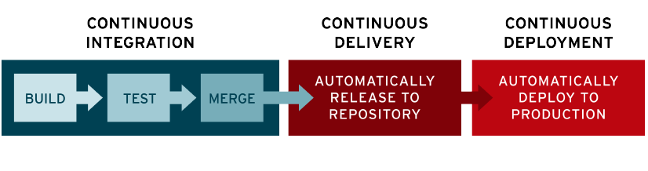
]

---

## Metodologia Devops y herramientas PaaS

- DevOps es un acrónimo inglés de development (desarrollo) y operations (operaciones), que se refiere a una metodología de desarrollo de software que se centra en la comunicación, colaboración e integración entre desarrolladores de software y los profesionales de sistemas en las tecnologías de la información (IT)

- Un PaaS, como su nombre lo indica, es una tecnología de plataforma como servicio que básicamente se encarga de proporcionarnos un entorno adecuado para el despliegue y el desarrollo de aplicaciones.

.pull-center[
   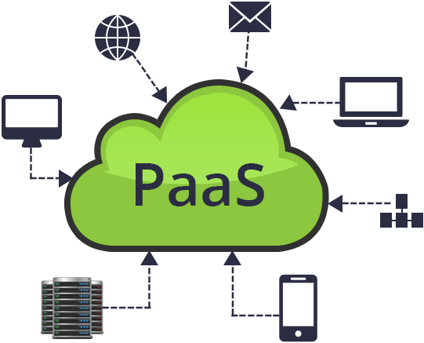
]

---

## Metodologia Devops y herramientas PaaS

Algunas herramientas PaaS

- [Heroku](https://www.heroku.com/)
- [AWS CloudFormation](https://aws.amazon.com/es/)
- [Google Cloud](https://cloud.google.com)
- [Microsft Azure](https://azure.microsoft.com/es-es/overview/what-is-azure/)
- [Always Data](https://www.alwaysdata.com) 

Estas plataformas ofrecen algunos de estos servicios

- Máquinas virtuales. Aplicaciones en la nube y máquinas virtuales Windows y Linux de gran capacidad.
- Aplicaciones WEB y Móvil. 
- Almacenamiento en la nube.
- Bases de datos.
- Aprendizaje automático.
- Análisis.
- Internet de las cosas.
- Redes virtuales.
- Otros...

Tener en cuenta que estos servicio puede separados se ofrecen gratis para siempre, prueba por 12 meses entre otros planes y por eso en la incripciones piden como autenticacion datos de tarjetas de creditos.

---

## Acceso y uso de GitHub

* Para acceder a git solo debemos tener una cuenta en [GitHub](https://github.com/)
* Los proyectos pueden crearse desde nuestro Git local o desde la propia cuenta git. 
* Nuestra credenciales (usuario y contraseña) son las claves que utilizaremos luego de generar los `git push`
* Para crear un proyecto, se accede a GitHub y se crea un proyecto nuevo o duplicar (forkear) un proyecto existente.

.pull-center[
   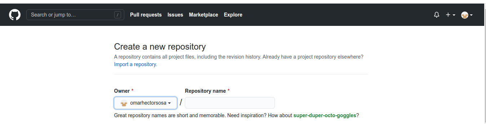
]

* Y desde nuestro local se clona el repositorio creado `git clone {url_proyecto}` 

---

## Heroku

.texto-grande[Heroku es plataforma especializada en ofrecer servicios de servidores y redes administrados en donde se pueden alojar aplicaciones de diferentes lenguajes de programación como Python, Java, PHP y más. ]

---

## Crear app en heroku

* Para acceder a heroku debemos tener una cuenta en [Heroku](https://www.heroku.com/)
* Se accede a la herramienta y se crea un app desde `new app`

.pull-center[
   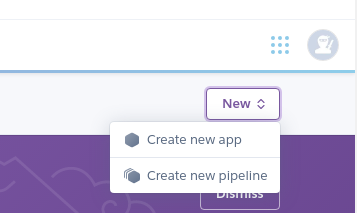
]

* Y se accede a la vista de la app 

.pull-center[
   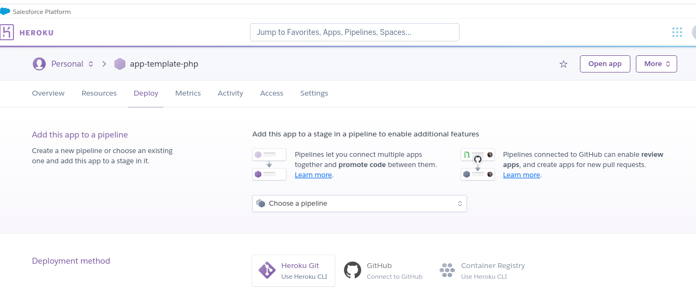
]

---

## Herramienta para establecer las entregas continuas (CD)

.texto-grande[Ya tenemos nuestro repositorio en `GitHub` y nuestra App en `Heroku`]

* Debemos implementas estas herramientas CD para poder hacer entregas continuas automatizadas. 
* Conectar nuestro repositorio de **GitHub** con nuestro app en **Heroku**
* Desde Heroku nos ubicamos en la seccion de implementacion **Deploy**

.pull-center[
   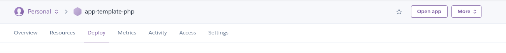
]

---

## Conectar mi repositorio git con mi app heroku

* Selecciono [GitHub](https://github.com/) como sistema de repositorio (conectado con mi usuario)

.pull-center[
   
]

* Busco y conecto el repositorio de **GitHub**

.pull-center[
   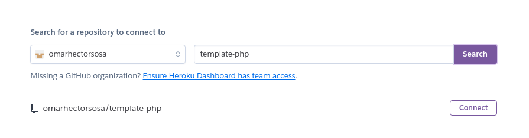
]

---

## Activar deploy automatico

Una vez que nos autentiquemos en `GitHub` y asignemos el proyecto tenemos que realizar los siguientes tareas:

1. `Vincular rama especifica`: Por defecto suele ser master, en tanto debemos entender que todo cambio en master deberia ser un "acto"  de deploy en produccion.
1. `Activar deploy automatico`: Esto no se activa automaticamente cada que vez que se sube un cambio en la rama indicada

.pull-center[
   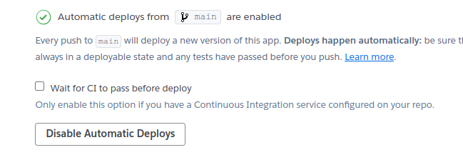
]

---

## Implementar proyecto y ver los cambios

* Desde mi maquina clono el proyecto `git clone {url_proyecto}` y creo un `index.php`
 
```markdown
<?php 

echo "Hola mundo"; 

?>

```

* Hacemos las operaciones (add, commit y push) correspondiente para subir lo cambios en **Github** y el deploy automatico en **Heroku**

```markdown
git checkout -b rama_trabajo
git status
git add .
git commit -m "Primer commit"
git push
``` 

En las tareas habituales se utilizan los `branch` para trabajar en conjunto y se usa los `push request` para luego mergear en la rama `main` y asi realizar la entregas continuas (CD).

---

## Implementar proyecto y ver los cambios

Al generar el push se genera el despliegue en forma automatica

.pull-left[
* Desde la cuenta de heroku reviso la actividad de la aplicacion y reviso el `build log`.
* Puede verificar desde el log general en `more->view log`
* Para acceder a la url se hace click en `Open app`
]

.pull-right[
   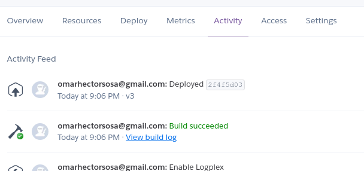
   
]

Y al final vemos el resultado accediendo al sitio `https://{nombre_app}.heroku.com` con el siguiente resultado. 

.pull-center[
   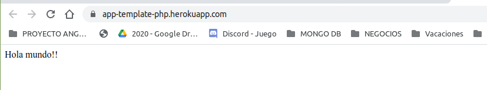
   
]

---

## Cliente de heroku 

Desde el cliente de heroku puedo ver el log del servidor hasta cambiar el codigo . 
 
```markdow
sudo snap install --classic heroku //Instalacion en linux
heroku --version 
heroku login   
heroku login -i  // Login desde la web 
heroku logs --tail --app {aplicación} // Logs de las acciones en la web
heroku buildpacks:set heroku/php --app {aplicación}  // Cambio del lenguaje a php
heroku buildpacks:set heroku/java --app {aplicación}  // Cambio del lenguaje a java
heroku buildpacks:set heroku-community/static --app {aplicación}  // Cambio a sitio estatico (html)
```

Desde Heroku tambien es posible visualizar el log desde el item `View logs`

.pull-center[
   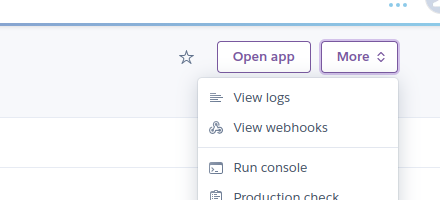
]

---

# CI/CD con AWS y GitLab: ¿Que es un AWS Bucket?

.texto-grande[Un bucket es un contenedor para objetos almacenados en Amazon S3. Puede almacenar cualquier cantidad de objetos en un bucket]

.pull-center[
   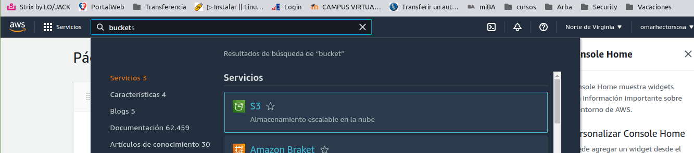
]

Aclaración: Para tener acceso a una cuenta AWS se debe realizar una sucripción gratuita pero con una tarjeta de credito como primera instancia.

---

# CI/CD con AWS y GitLab: Crear y configura un bucket

En principio debemos acceder al servicio `S3` y luego crear un bucket.

.pull-center[
   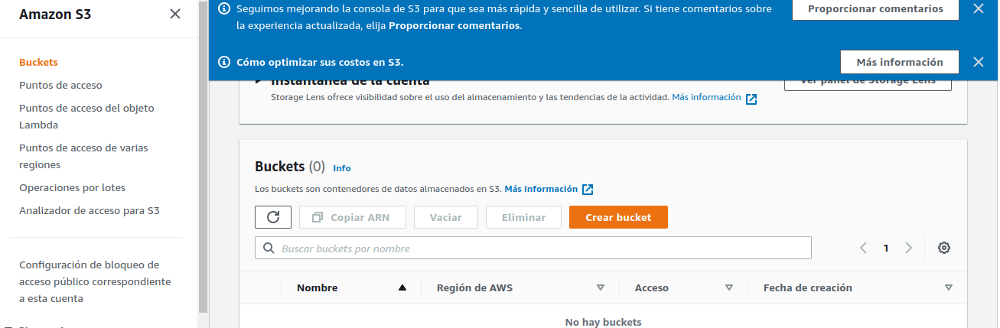
]

Configuramos el bucket.

.pull-center[
   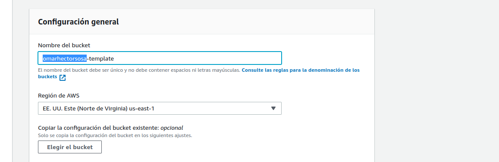
]
---

# CI/CD con AWS y GitLab: Crear y configura un bucket

Configurar el bucket para que sea publico

.pull-center[
   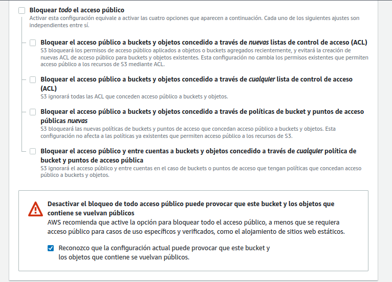
]

---

# CI/CD con AWS y GitLab: Crear y configura un bucket

Al finalizar la creacion del bucket se presenta en el listado  

.pull-center[
   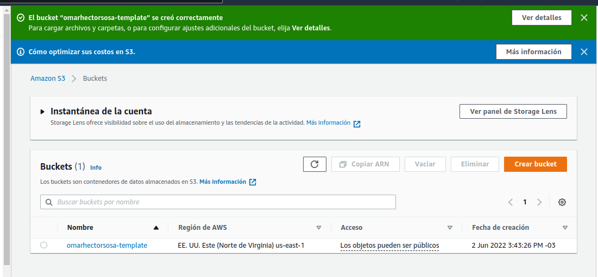
]

---

# CI/CD con AWS y GitLab: Crear y configura un bucket

Luego tenemos que agregar las politicas del `bucket` creado ingresando a la edicion de bucket en la seccion de `permisos`

.pull-center[
   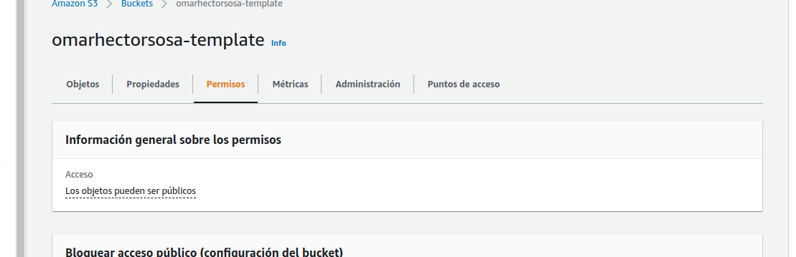
]


---

# CI/CD con AWS y GitLab: Crear y configura un bucket

Agregar las siguientes politicas de ejemplo [Ver politicas](https://docs.aws.amazon.com/AmazonS3/latest/userguide/access-policy-language-overview.html)

.pull-center[
   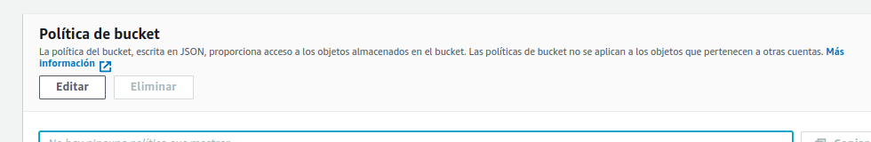
]

Tambien es posible generar una Politica desde [Generador politicas](https://awspolicygen.s3.amazonaws.com/policygen.html)

```markdow
{
  "Id": "Policy1654200096995",
  "Version": "2012-10-17",
  "Statement": [
    {
      "Sid": "Stmt1654200095421",
      "Action": [
        "s3:GetObject"
      ],
      "Effect": "Allow",
      "Resource": "arn:aws:s3:::omarhectorsosa-template/*",
      "Principal": "*"
    }
  ]
}
```

---

# CI/CD con AWS y GitLab: Crear y configura un bucket

Una vez aplicada la politica veremos que el bucket se hace publico

.pull-center[
   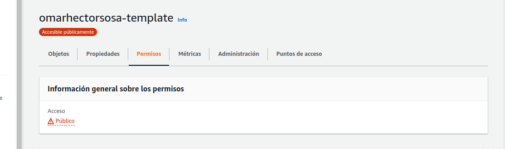
]

Viendo que el bucket esta disponible podemos cargar una imagen para verificar su disponibilidad.

---

# CI/CD con AWS y GitLab: Configurar CI/CD en GitLab

Se debe agregar las siguientes variables: 

- Configuracion de region `AWS_REGION`
- Configuración de id de accesos: `AWS_ACCESS_KEY_ID`
- Configuracion de clave secreta: `AWS_SECRET_ACCESS_KEY`
- Configuracion del bucket : `DEV_S3_BUCKET`

---

# ¿Que es Jenkis?

- Jenkins es un servidor open source para la integración continua. 
- Es una herramienta que se utiliza para compilar y probar proyectos de software de forma continua.
- Facilita a los desarrolladores integrar cambios en un proyecto y entregar nuevas versiones a los usuarios

.pull-center[
   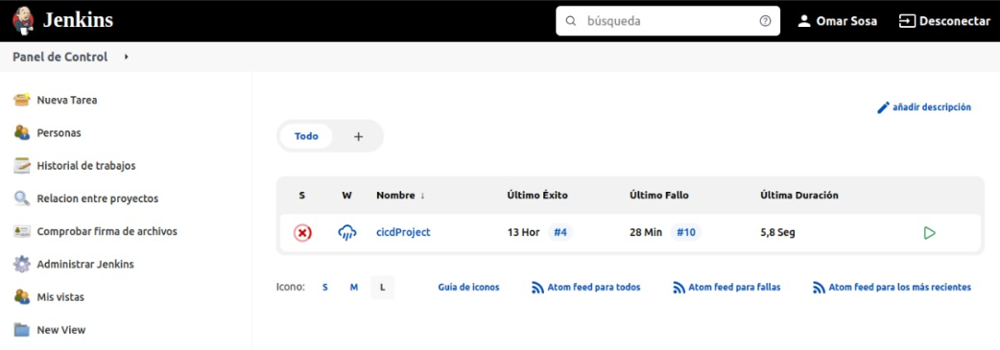
]

---

# Jenkis : Intalación

Comienzo la instalación

`wget -q -O - https://pkg.jenkins.io/debian-stable/jenkins.io.key | sudo apt-key add -`
`sudo sh -c 'echo deb https://pkg.jenkins.io/debian-stable binary/ > /etc/apt/sources.list.d/jenkins.list'`
`sudo apt-get install jenkis`

Para poder avanzar con la instalacion se debe descubir el password incial

`sudo cat /var/lib/jenkins/secrets/initialAdminPassword`

---

# Jenkis : Configurar repos de github y heroku

En esta etapa se deben configurar en el proyecto ambos repositorios con sus nombres de repositorios,  los mismos se pueden ver con el siguiente comandos: 

```
git remote -v
heroku  git@heroku.com:your-project.git (fetch)
heroku  git@heroku.com:your-project.git (push)
```

.pull-center[
   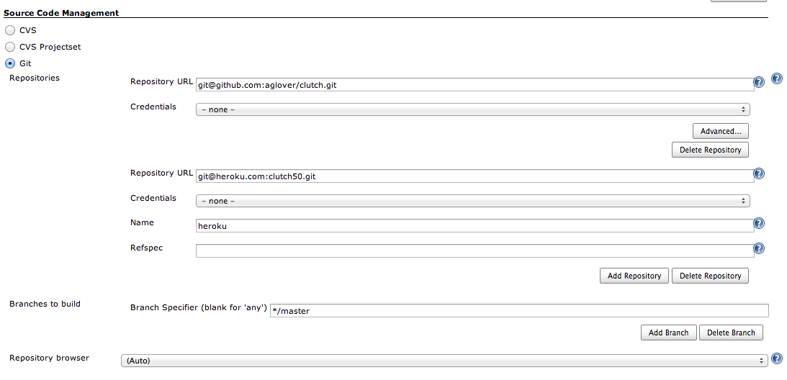
]


---

# Jenkis : Tareas en jenkis

`¿CÓMO CREAR UNA TAREA EN JENKINS?`

Dependiendo de los permisos del usuario, en el dashboard inicial aparecerá la opción “New Item“

- Nombrar la tarea acorde con la actividad
- Escoger “Freestyle project“
- Ir a “configure“

`¿CÓMO CONFIGURAR UNA TAREA DE JENKINS?`

Una tarea en Jenkins de tipo “Freestyle project” se ejecuta teniendo en cuenta el siguiente flujo:

- General: Define aspectos generales del proyecto
- Source Code Management: Define dónde se encuentra el proyecto (CVS, Git, etc)
- Build Triggers: Define qué acción va a hacer que el proyecto que estamos creando se ejecute
- Build Environment: Define el entorno en el que se ejecutará la tarea
- Build: Define qué acciones realizar al momento de realizar la ejecución de la tarea, por ejemplo, ejecutar un comando en una linea de comandos
- Post-build Actions: Define acciones posteriores a la ejecución de la tarea
Para el ejemplo crearemos un flujo configurando algunos aspectos a manera de ejemplo.

---

# Jenkis : Fuente de codigo

En esta pestaña configuraremos Git como el repositorio donde se encuentra el código a desplegar:

* Repositorio 1:
- Repository URL: url donde se encuentra el código (github, bitbucket, gitlab, etc)
- Credentials: Credenciales para el ingreso a este repositorio
* Repositorio 2:
- Repository URL: url del repositorio en heroku
- Credentials: Credenciales para el ingreso a este repositorio

.pull-center[
   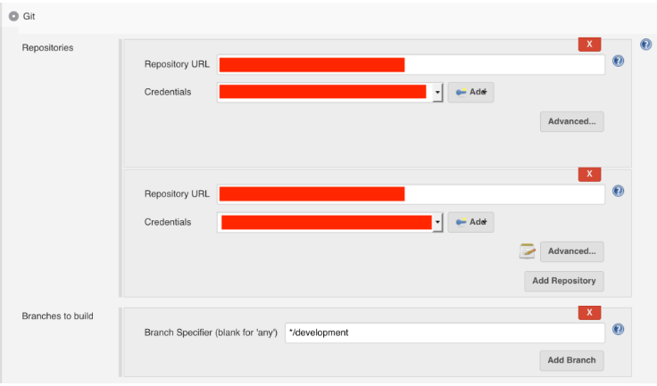
]

Notas:
En nuestro caso tendremos que agregar otro repositorio ya que descargaremos el código de un origen y lo subieremos a otro (heroku), no olvidar añadir el nombre de este nuevo origen.
No olvidar que si queremos que las pruebas se ejecuten en una rama en particular, debemos configurar la rama en el parámetro “branches to build”, en nuestro caso, develop

---

# Jenkis : Creamos lanzadores

Queremos que la tarea de Jenkins se ejecute cada vez que existe un cambio en la rama develop de nuestro repositorio, para esto seleccionamos la opción “Build when a change is pushed to BitBucket”

.pull-center[
   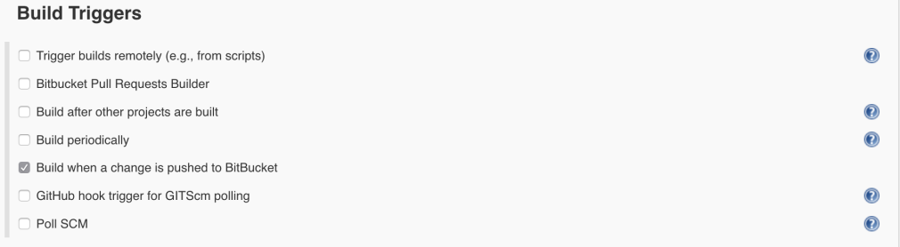
]

---

# Jenkis : Deplegar en heroku

Después de ejecutar las pruebas queremos que se realice el despliegue automático de nuestra aplicación en Heroku, ya que para hacer el despliegue en Heroku tan solo es necesario realizar push a la rama master del proyecto, debemos:

- Añadir la acción “Git Publisher” en la opción “Add post-build action“
- Habilitar las siguientes opciones:
- Push Only If Build Succeeds: Esto permitirá que se realice el push siempre y cuando las acciones anteriores hayan sido exitosas
- Añadiremos un branch con el botón “Add Branch“
- En “branch to push” configuraremos el nombre de la rama donde queremos hacer el push, master
- En “target remote name” configuraremos el nombre del repositorio remoto, heroku

.pull-center[
   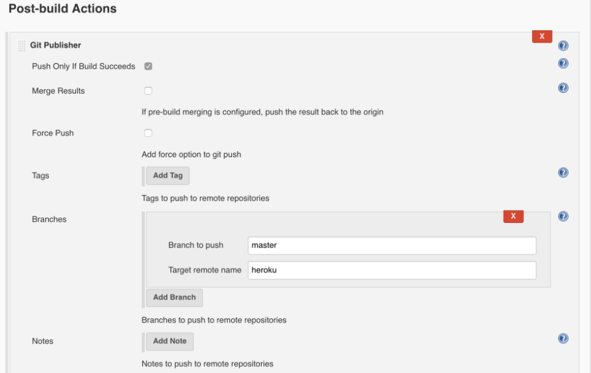
]

---

# Jenkis : Crear llave publica para Github

Crear las llaves en el local

`ssh-keygen -t rsa`

Esto generar el archivo `id_rsa` en la carpeta `.ssh` copia su contenido en la llave creada en GitHub. 

.pull-left[
   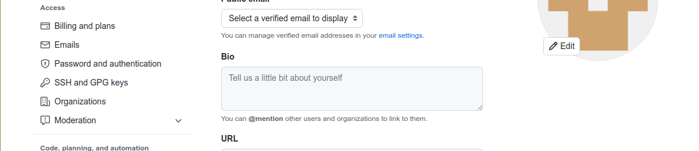
]

.pull-right[
   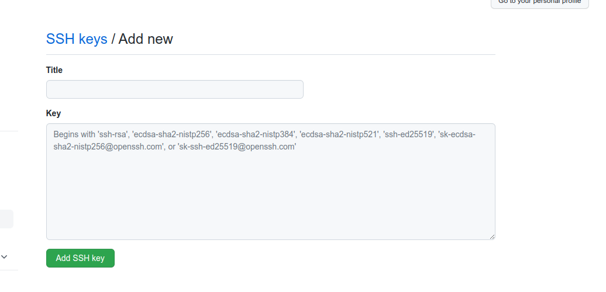
]
---

# Jenkis : Crear llave publica para heroku


Comenzar a configurar el accesoa los repositorios ejecutar los siguiente comando para obtener las claves de heroku: 

`ssh-keygen -t rsa`

Esto generar el archivo `id_rsa` copia su contenido para crear la llave en Jenkis. 

Luego ejecutar los siguientes comandos

`heroku keys:add`
`git push heroku`

---

# GitHuB : Notificaciones de cambios a jenkis con Webooks 

Creo una conexion con mi local

`ngrok http 8080`

Luego agrego la direccion de jenkis

`{dominiogenerado}/github-webhook`

Luego verifico la tarea en `jenkis`

---

## Conectar base de datos local con `hgrok`

Teniendo instalado `mysql` en mi maquina local genero un puente para acceder desde la web publicada

`hgrok tcp 3306`

.pull-center[
   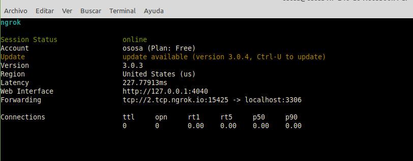
]

---

## Base de datos remota

Desde [PhpMyAdmin](https://www.phpmyadmin.co/) podemos acceder a la adminstracion de la base de datos.

.pull-center[
   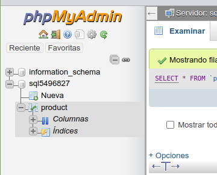
]

---

## Conectamos a la base local en el codigo en `Heroku`

Teniendo informada los datos de coneccion accedo a la base  de datos desde `heroku`

```markdown
<?php

   echo '<body><main clas="container">';

   echo '<div class="row text-center bg-success mb-10"><div class="col-12">Tabla.</div></div>' ;

   if (!($conexion=mysqli_connect("sql5.freemysqlhosting.net","sql5496827","tAee5z4mwN","sql5496827"))) { 
      echo '<div class="row"><div class="col-12">Error conectando a la base de datos</div></div>' ;
      echo '</main></body>';  
      die(); 
   } 

   $res = mysqli_query($conexion,"SELECT * FROM product") or die(mysqli_error($conexion)); ;

   while($reg = mysqli_fetch_array($res)){
      echo '<div class="row text-center b-10 boder-secondary border-radius border-5"><div class="col-3 bg-primary border boder-secondary  border-2">'.$reg["id"].'</div>';
      echo '<div class="col-3 bg-primary border boder-secondary  border-2">'.$reg["name"].'</div>';
      echo '<div class="col-3 bg-primary border boder-secondary  border-2">'.$reg["price"].'</div>';
      echo '<div class="col-3 bg-primary border boder-secondary  border-2">'.$reg["description"].'</div></div>';
   }

?>
```

---

## Uso de enlaces

El sistema de enlaces es el mismo que el markdown:

* [Git](https://git-scm.com/doc).
* [Heroku](https://www.heroku.com/).
* [Tutorial](https://youtu.be/hWglK8nWh60).
* [Paas](https://www.teamnet.com.mx/blog/paas-en-la-metodolog%C3%ADa-devops)
* [Alternativas a Heroku](https://saasradar.net/mejores-alternativas-a-heroku/#AlwaysData)
* [CD/CI con AWS](https://www.youtube.com/watch?v=3RY3rBhUrE0)
* [Integracion Jenkis](https://dev.to/mariehposa/achieving-continuous-integration-and-deployment-with-jenkins-4d6k)
---
class: center, middle, inverse

## Gracias!


